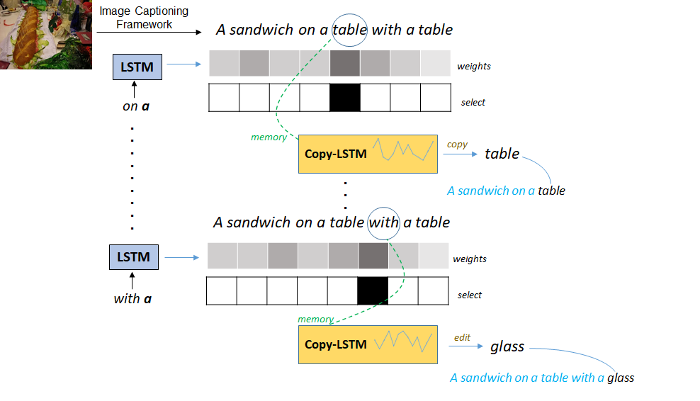

## Show, Edit and Tell: A Framework for Editing Image Captions
This contains the source code for *Show, Edit and Tell: A Framework for Editing Image Captions*

 

### Requirements
- Python 3.6 or 3.7
- PyTorch 1.0 or higher

For evaluation, you also need:
- Java 1.8.0
- [coco-api](https://github.com/cocodataset/cocoapi)
- [cococaption python 3](https://github.com/mtanti/coco-caption)

